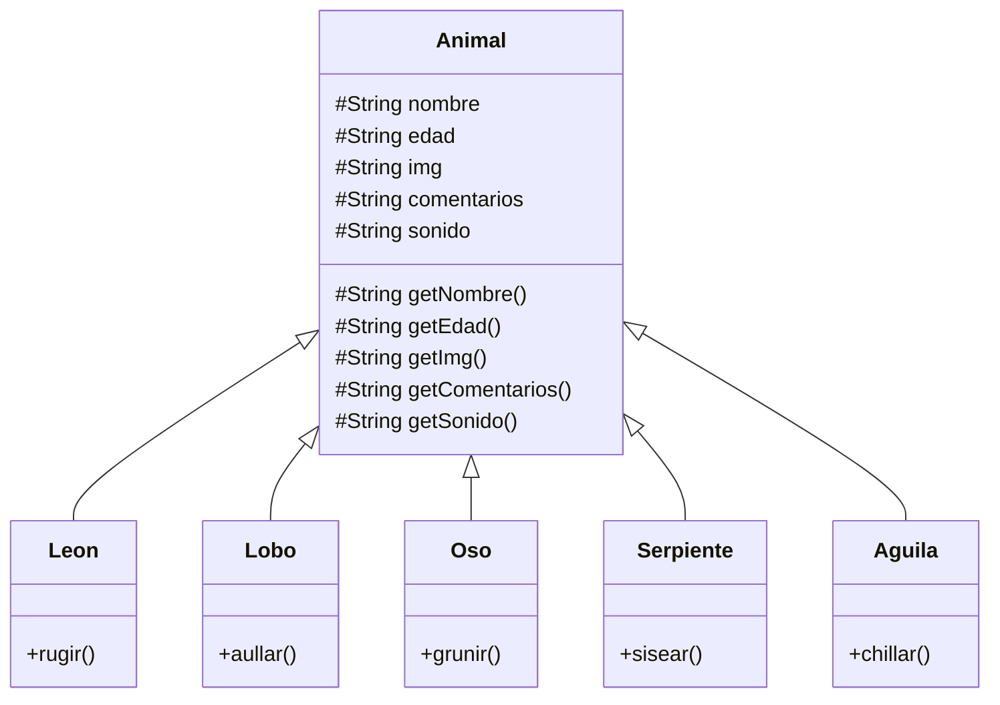

# Desafío Animales

El proyecto está basado en el desafío del módulo `programación avanzanda con JS`

Para el desafío se considera la siguiente estructura de clases, la cual se puede encontrar en `./assets/js/classes` todas invocadas en `./assets/js/main.js`

