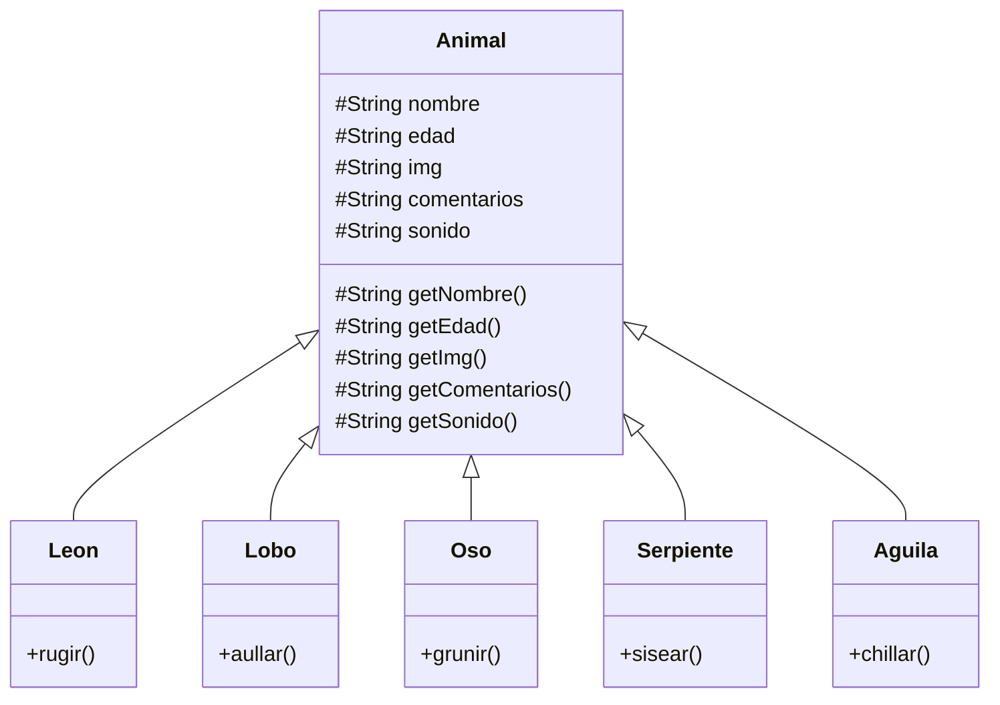
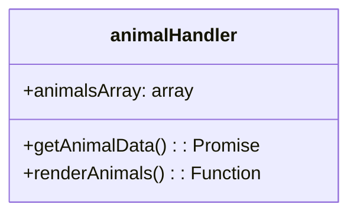

# Desafío Animales

El proyecto implementa una solución al desafío final del módulo `programación avanzanda con JS`

## Implementación de clases

Para el desafío se considera la siguiente estructura de clases, la cual se puede encontrar en `./assets/js/classes` todas invocadas en `./assets/js/main.js`

## Implementación de Módulo

Para dar cumplimiento a la implementación de un `IIFE` se crea un módulo con la siguiente estructura

donde `getAnimalData()` es la promesa que trae la información desde `animales.json`, `animalsArray` es el array que se encarga de mantener el estado de los animales creados. No se implementa lógica para modificar posibles animales.
Por último la función `renderAnimals` se encarga de renderizar los animales en la "sección tabla"

### importante sobre `getAnimalData()`

Esta función refactoriza el trabajo dealizado en clases respecto a la obtención asíncrona de datos desde `animales.json()`

## Eventos y manejo de formulario

En `index.js` se importan las clases y el módulo, para hacer uso de ellos en los `callbacks` utilizados en `addEventListener`
