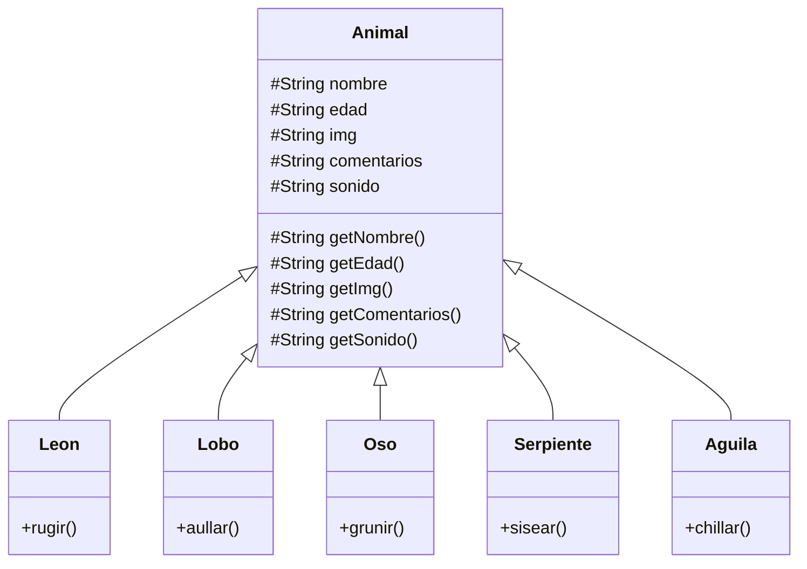
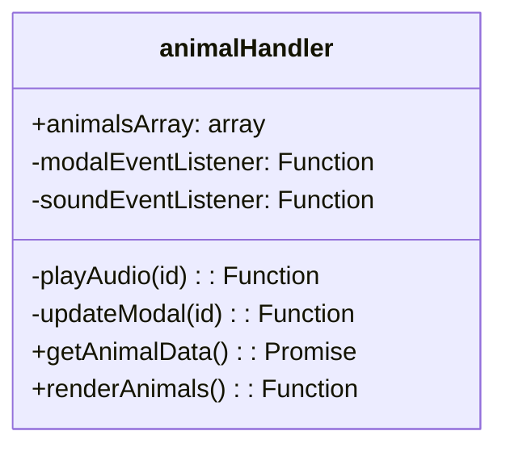

# Desafío Animales

El proyecto implementa una solución al desafío final del módulo `programación avanzanda con JS`

## Implementación de clases

Para el desafío se considera la siguiente estructura de clases, la cual se puede encontrar en `./assets/js/classes` todas invocadas en `./assets/js/main.js`. Para poder acceder a los comentarios desde las clases se cambió `set` por `get` para comentarios



## Implementación de Módulo

Para dar cumplimiento a la implementación de un `IIFE` se crea un módulo con la siguiente estructura



### `getAnimalData()`

Es la promesa que trae la información desde `animales.json`, `animalsArray` es el array que se encarga de mantener el estado de los animales creados. No se implementa lógica para modificar posibles animales.
Por último la función `renderAnimals` se encarga de renderizar los animales en la "sección tabla"

#### importante sobre `getAnimalData()`

Esta función refactoriza el trabajo dealizado en clases respecto a la obtención asíncrona de datos desde `animales.json()`

### animalsArray

Es un array que almacena las instancias de los animales creados a través del formulario

### -modalEventListener()

Es una función privada que analiza el DOM buscando todas las
imagenes que cumplen con `.participante > div > img` que renderizan las cartas con animales, y les agrega un event listener usando la función pública `updateModal`

### -updateModal(id)

Función que actualiza el contenido del modal, usando como argumento el índice del animal en el array `animalsArray`

### -soundEventListener()

Es una función privada que analiza el DOM buscando todas las
imagenes que cumplen con `.participante > div > buttpn` que renderizan las imágenes con parlantes, y les agrega un event listener usando la función pública `playAudio`

### -playAudio(id)

Función atenta al evento click de los botones de audio que crea un objeto de audio usando la ruta del audio, y luego lo reproduce

## `index.js`: Eventos y manejo de formulario

En `index.js` se importan las clases y el módulo, para hacer uso de ellos en los `callbacks` utilizados en `addEventListener`.

### Objetos de importancia en `index.js`

Con la finalidad de manipular la creación de instancias basado en el nombre del animal, es que se crea el siguiente objeto:

```js
const constructoresAnimal = {
  Leon: Leon,
  Lobo: Lobo,
  Aguila: Aguila,
  Oso: Oso,
  Serpiente: Serpiente
}
```

Este objeto hace una relación univoca entre la llave "texto" del animal, y el constructor importado desde su respectiva clase. Por ejemplo

```js
new constructoresAnimal["Serpiente"](argumentos)
```

es identico a usar

```js
new Serpiente(argumentos)
```

de esta forma podemos usar programáticamente el nombre del animal en `constructoresAnimal` para obtener una instancia de una determinada clase.

### HTML y su manipulación con JS | `eventListener`

Existen 2 tipos de imputs en el formulario a los cuales debemos agregar `eventListener`.
El primero es un elemento de tipo `<select>` con opciones.

```HTML
<select class="form-control bg-dark text-white" id="animal">
  <option disabled selected>Seleccione un animal</option>
  <option value="Leon">León</option>
  <option value="Lobo">Lobo</option>
  <option value="Oso">Oso</option>
  <option value="Serpiente">Serpiente</option>
  <option value="Aguila">Águila</option>
</select>
```

Al analizar sus propiedades en JS nos encontramos con lo siguiente:

#### Propiedad `value`

La propiedad value nos muestra la opción seleccionada en un determinado momento, un ejemplo de salida podría ser:

```js
document.getElementById("animal").value // -> "Leon"
```

#### Propiedad `selectedIndex`

La propiedad `selectedIndex` nos permite modificar la opción seleccionada en base al índice de las opciones. EJ:

```js
// La propiedad
document.getElementById("animal").selectedIndex = 0 // -> <option disabled selected>Seleccione un animal</option>
```

En `index.js` se hace uso de estas propiedades para manipular el formulario junto con los eventos `change` que nos permite estar atentos al cambio de selección y al evento `click` que nos permite manipular el DOM en caso de click del usuario.
